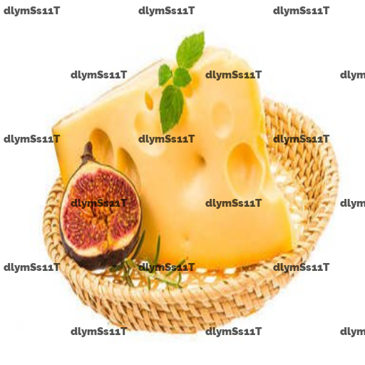

# Watermark-Remover


Open-source application for watermark removal based on CNN. 

## How to use

```python
python3 watermark_remover.py --image input.png
```

**Exmaple**

<table>
  <tr>
     <td>Before</td>
     <td>After</td>
  </tr>
  <tr>
    <td></td>
    <td></td>
  </tr>
 </table>

## Docker
Application can be run with docker. 

### Build

```bash
docker build . -t watermark_remover
```

### Run
```bash
docker run -v$(pwd):/home -p 8888:8888 watermark_remover
```

Or if you want to retrain the model you need access to your S3 for which you have to define keys in .env file. Then you can run this command. 

```bash
docker run -v$(pwd):/home -p 8888:8888 --env-file .env watermark_remover .env
```
